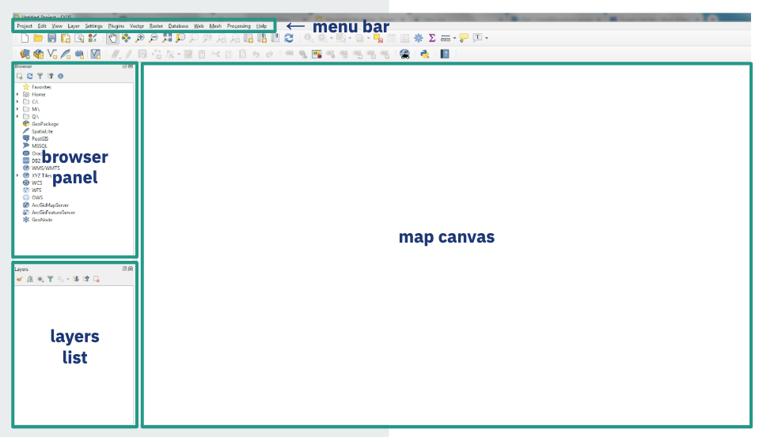
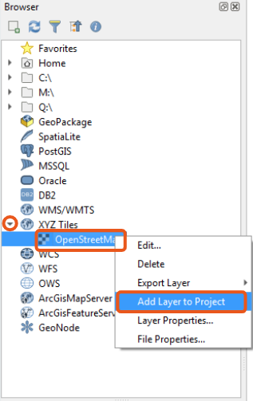
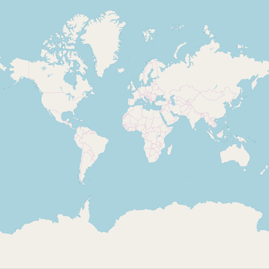
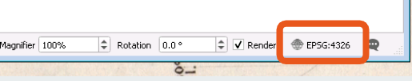

# Mapmaking 101
Using GIS to make a choropleth map

**By the end of this workshop, you will...**
- Understand what a GIS is and when to use one
- Understand the types of data that are compatible with a GIS
- Learn how to use basic tools in QGIS, a popular GIS software
- Make a thematic map!

## About us
**The Norman B. Leventhal Map and Education Center (LMEC):**
- Caretakers of BPL's map collection
 - 200,000 maps and 5,000 atlases
- Gallery space with map exhibitions on a range of topics
- Resource center for geography and cartography

**Where you can find us:**

## GIS Basics
**What does GIS do?**
- Create digital maps from existing data sources
- Perform spatial analysis, which doesn’t necessarily require actually making a map
- Collect and parse geographic data from individuals, satellites, sensors and so on
- Manage the spatial attributes of data

**GIS software packages**
- ESRI Arc Suite
 - The “Microsoft Office” of GIS
- FOSS (Free And Open Source Software) Alternatives
 - QGIS
- Software that doesn’t feel like GIS at all…
 - Google Maps, Apple Maps, Mapbox, Carto, other Web-based mapping tools

**Three major types of data:**

## Making the map!
You are going to make this map:

1. **But first, you need to download the data.** [Click here](tinyurl.com/bpl-map-workshop "workshop data") for the data, and download the files **senior_ecards_counts.csv** and **ma_zipcodes.gpkg**.

2. Open QGIS.

3. Add a new project.

Your screen should now look like this!

4. Add a basemap to your project. A basemap provides context for the data that you bring in -- it's not always necessary, but it usually adds a nice touch.

Your screen should now have a white and blue map of the Earth on it, like this:

> **A quick note about coordinate systems:**
- Need to convert between coordinate systems on the earth’s surface (round) and the coordinate systems on your computer screen (flat)
- Simplest: use latitude/longitude
(we call this WGS 84, or EPSG:4326)
- Always check the bottom righthand corner to verify that your project is in your desired coordinate system!!

*grey-out text*

Example of a dropdown 

- dropdown bullet 1 
- dropdown bullet 2

!> danger!

> note
