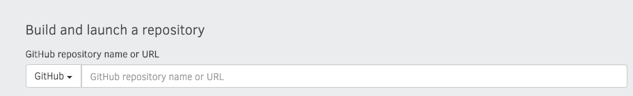
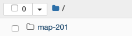

## Description 
This course offers a simple introduction to the Python programming language for creating maps using code, rather than a visual software interface. It also includes basic methods for collecting and cleaning data sets from the web. 

## Upcoming dates
Thursday, February 20, 10am - noon. Register on [Eventbrite](https://www.eventbrite.com/e/mapmaking-201-basic-mapmaking-in-python-tickets-88402665753 "Eventrbite")  

Thursday, March 26, 10am - noon. Register on [Eventbrite](https://www.eventbrite.com/e/mapmaking-201-basic-mapmaking-in-python-tickets-88402868359 "Eventrbite")  

## Working at Home
One of the simplest way to complete these workshops at home is by working in your web browser! To work online, navigate to [MyBinder](https://mybinder.org/). You should see a box that looks like this: 

Copy and paste the github url for [LMEC workshops](https://github.com/nblmc/workshops) into that space and press the launch button. It may take a while to setup. 

After everything is finished loading, you should see a webpage with a folder for map 201  Explore this folder and find a lesson that you'd like to work on. Click on an ipynb file to open up the tutorial for that lesson. If you're not familiar with Python or Jupyter, try starting out with basics.ipynb.

## Workshop Lessons

Python Basics

Heatmap

Data Cleaning with Maps